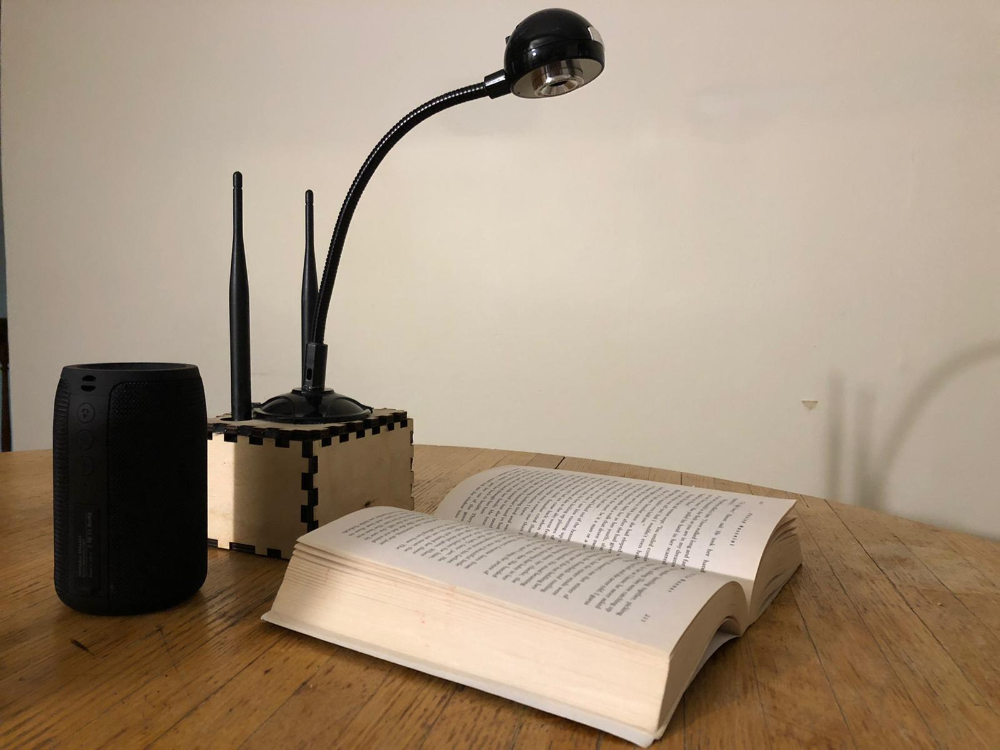

# Robot-Will: your reading companion

## Inspiration

Hello and thank you for having us at the WPI Hackathon! It couldn’t have been a more conductive environment to rethink how we as a student community can be more inclusive and make feel everyone belonged. As our team brainstormed on ideas that can impact our community, we realised we could share the basic joys of life – Reading! And realised we can share the simple joy of reading with the visually impaired member through a compact, portable and affordable device. So we developed a robot and named it 'will'.
What it does

So, Robot 'Will' is empowered to read a page of printed or handwritten text and read it aloud. Interestingly, our robot will enable human collaboration and interaction by inviting the user to turn pages of the book and thus maintaining the naturalness of reading.
How we built it

The robot is built upon a Nvidia Jetson Nano, a Webcam, and a Bluetooth speaker. It is powered using a 5V, 4A current source and is designed to be portable. A sturdy wooden enclosure packages the unit well and gives the product a clean, traditional and yet a modern feel. The Nvidia Jetson Nano is loaded with a Wifi module to take advantage of connecting to online resources for updating the program and connect the user to a plethora of other features including access to Podcasts, audiobooks, and audio lectures.

## Design and Fabrication

We designed a well-ventilated and a simple looking wood casing to enclose the processor and give the product a cleaner look. We used laser cutting for rapid prototyping and attached the Webcam to the enclosure. Following are the 5 steps of operation:

    Capture an image of the page
    Pre-process the image
    Generate text from the image with OCR (Optical Character Recognition) using Python-tesseract
    Generate Audio from the text file using GTTS (Google Text to Speech Library) we obtain an audio file
    Play the Audio file

## Challenges we ran into

Brainstorming an idea and searching for the resources was challenging. We started with 7 ideas and filtered them through the lens of impact, demand, cost for the customer and manufacturer, and feasibility considering the tight time frame. CODING

## Accomplishments that we're proud of

We made a product that could read out a book! The team demonstrated the courage to pick up the ideas, learn through online resources, tutorials and implement chuncks of relevant code and finally integrate it.

## What we learned

Rapid Prototyping and Laser cutting. We learnt to use the Nvidia Jetson nano, GTTS, and Python-Tesseract. It was a good experience to search for resources and incorporating Optical character recognition and text to speech in the code.
What's next for Robot: 'Will' - your reading companion!

Design refinement to make the design more elegant, compact and power efficient. This product can be developed further to be used as a gesture capturing and enhance communication with the speech impaired people.

    We plan on including an intuitive user interface to make it easier to use.
    We can add a better camera and use a robotic arm to focus on the text autonomously (Visual Servoing).

